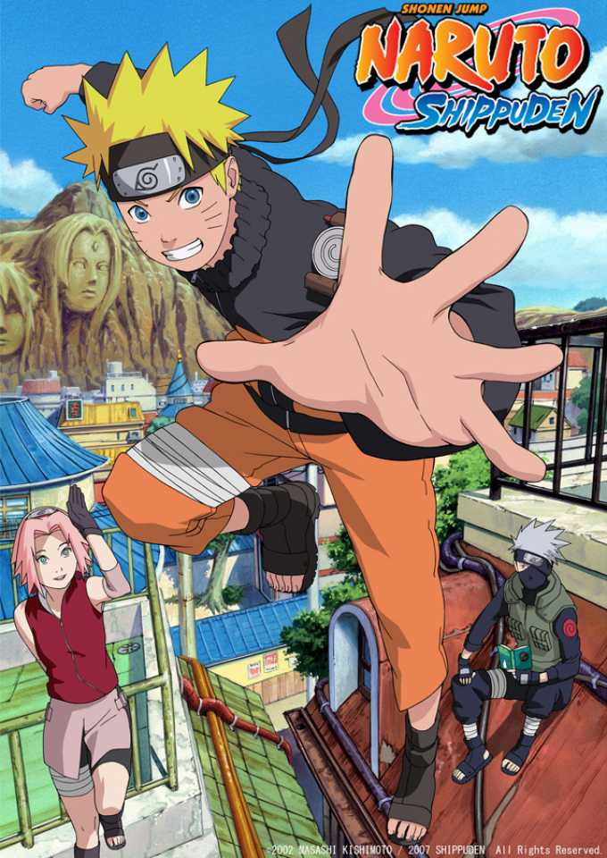

# landingnarudatebayo
https://exequielbaldez.github.io/landingnarudatebayo/
body {font-family: 'Roboto', cursive;
     margin: 0}
.banner-wrap {
        background-image: url(LOGO/narubaner.jpg); 
		background-size: cover;
		background-position: center;
		padding: 200px 0 50px 0;
		text-align: center;
}

h1{
	color: white;
	font-size:45px;
	margin: 0;
	font-weight: bold;

}

.banner-wrap p{
	color: rgba(255,255,255, .7);
	font.size: 24px;
	opacity: 0.85;

}

button a{background-color: red;
	color: white;
	padding: 5px 15px;
	border-radius: 4px;
	display: inline-block;
	text-decoration: none;
	transition: 3s
	font-size:50px;
	font-weight: bold;
	border: none;}

	button {background-color: #000000;
	color: white;
	padding: 5px 15px;
	border-radius: 4px;
	display: inline-block;
	text-decoration: none;
	transition: 3s
	font-size:50px;
	font-weight: bold;
	border: none;}

.cards-wrap{
	width: 860px;
	margin: 60px auto;

}

.cards-container{
	display: flex;
	flex-direction: row;
	align-items: center;
	justify-content: space-between;

}

.card{
	background: white;
	box-shadow: 0 0 16px rgba(0,0,0,0.9);
	border-radius: 4px;
	padding: 24px;
	margin: 0px 20px;

}
.card img{
	width: 200px;
	height: 200px;

}

footer{
	background: #404042;<!DOCTYPE html>
<html lang="en">
  <head>
    <meta charset="utf-8">
    <title>Datebayo</title>
    <link rel="stylesheet" href="estilo.zzz.css">
          <link rel="shortcut icon" type="image/x-icon" href="LOGO/logo.png">
          <LINK REL="stylesheet" TYPE="text/css" HREF="css/estilo.zzz.czz">

  </head>
  <body>

  <h1>Naruto</h1>
  
El Camino Ninja

   <button><a href="https://shippuden.tv/" target="_blank" class="btn-blue">Capitulos</a>
   </button>
   
  

  <h2>Temporadas</h2>
  

      

        
        <h3>Naruto</h3>
        
220 Episodios

        <button><a href="https://naruto.fandom.com/es/wiki/Naruto_(Anime)#Historia">Informacion</a>
   </button>

      

      

        
        <h3>Naruto Shippuden</h3>
        
500 Episodios

        <button><a href="https://naruto.fandom.com/es/wiki/Naruto:_Shipp%C5%ABden">Informacion</a>
   </button>

      

      

        
        <h3>Boruto</h3>
        
En emision

        <button><a href="https://naruto.fandom.com/es/wiki/Boruto:_Naruto_Next_Generations_(Anime)">Informacion</a>
   </button>
        
      

      

<footer>
  
La Voluntad de Fuego

</footer>

  </body>
</html>
	color: white;
	padding: 15px 35px;
	position: fixed;
	bottom: 0;
	left: 0;
	right: 0;
}

footer p{
	margin: 0;
}

.container{
	width: 900px;
	margin: 60px auto;
}
